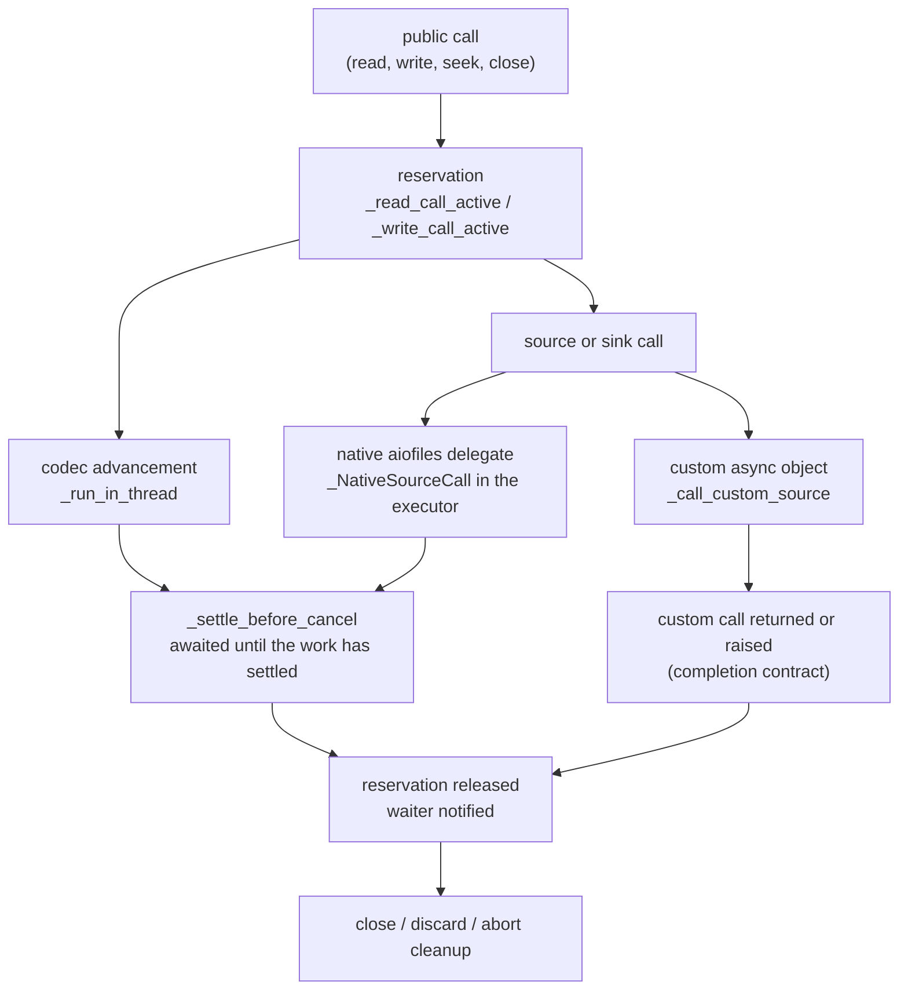

# b2 file-state model

This is the developer model of the asyncio file handles in 2.0.0b2: who owns
each piece of state, how it changes, and which tests pin it. It consolidates
the WP1–WP9 design records and describes the production candidate `a7c3880`.
The [WP0 pre-repair inventory](#appendix-wp0-pre-repair-inventory) is kept
unchanged at the end as history; it describes defects that have since been
repaired.

Symbols and tests are named; line numbers are not used, because they drift.
The executable form of the transition tables is `tests/stateful/model.py`
(`LIFECYCLE`, `READ_HEALTH`); if this page and the model disagree, the model
and its tests are authoritative and this page is stale.

## Sources of truth

| Topic | Authority |
| --- | --- |
| Public API | the frozen b1 manifest `tests/data/public_api_2_0.json`, checked by `scripts/capture_public_api.py --check` |
| Behavior differences from b1 | the [behavior-exception ledger](../reviews/v2.0.0b2-behavior-exceptions.md), BC1–BC11 |
| Corrected reference | C0, `refs/c0/v2.0.0b2` at `b074bdc` ([record](../reviews/v2.0.0b2-c0-record.md)) |
| Lifecycle and read-health transitions | `tests/stateful/model.py`, checked against the candidate's private state by `tests/stateful/observer.py` |
| Gzip framing, members, CRC and limits | `src/aiogzip/codec.py` (the single gzip state machine; see `CLAUDE.md`) |

## Source symbols

| Concern | Symbols | Module |
| --- | --- | --- |
| Read health | `_ReadHealth` (`HEALTHY`, `VALIDATION_SALVAGE`, `BROKEN`), the field `_read_health`, module aliases `_HEALTHY`, `_VALIDATION_SALVAGE`, `_BROKEN` | `_binary.py` |
| Health transitions | `_reset_read_health`, `_poison_read`, `_break_read_on_abort`, `_break_read_after_failed_text_seek`, `_rewind_reader` | `_binary.py` |
| Health predicates for text | `_read_cursor`, `_read_is_healthy`, `_has_validation_failure`, `_can_restore_failed_read`, `_validation_salvage_exhausted`, `_check_read_usable` | `_binary.py` |
| EOF and positions | `_eof`, `_position` (logical), `_compressed_cache`, `_replay_offset`, `_pending_compressed_chunk` (transport) | `_binary.py` |
| Call reservations | `_read_call_active`, `_write_call_active`, `_active_call_waiter`; `_BinaryReadReservation`, `_BinaryWriteReservation`, `_TextReadReservation`, `_TextWriteReservation` | `_binary.py`, `_text.py` |
| Opening ownership | `_opening` reservation; `_acquire_path`, `_write_initial_header`, `_initial_seekable` | `_binary.py`, `_text.py`, `_opening.py` |
| Closure and abort | `_mark_closed`, `_close_locked`, `_close_on_context_exit`, `_abort_active_call_on_exit`, the abort counter `_read_aborts` | `_binary.py` |
| Writer health | `_write_broken`, `_check_write_call_available`, `_check_write_usable` | `_binary.py` |
| Native codec work | `_run_in_thread`, `_settle_before_cancel` | `_codec_async.py` |
| Native and custom source work | `_NativeSourceCall`; `_call_native_source`, `_call_custom_source`, `_source_native_call`, `_source_work` | `_source_io.py`, `_binary.py` |
| Header observation | `_decoder_header_generation`, `_mtime` | `_binary.py` |
| Text checkpoint | `_TextBufferOrigin`, the live `_buffer_origin`, `_pending_read_origin`, `_readlines_rollback_state`, `_rollback_readlines`; seek rollback `_seek_rollback_state`, `_restore_seek_rollback_state`, `_invalidate_failed_seek` | `_text.py` |
| Text/binary bridge | `_attach_text_observers`, `_detach_text_observers`, text's latch `_read_poison_seen` | `_binary.py`, `_text.py` |
| Iterable-stream fairness | `_StreamBudget` | `_codec_async.py`, `_streaming.py` |

## Lifecycle

Lifecycle (`UNOPENED`, `OPENING`, `OPEN`, `CLOSED`) is independent of read
health, EOF and active calls. The 20 rows of `model.LIFECYCLE`:

| From | Event | To | Outcome |
| --- | --- | --- | --- |
| UNOPENED | open starts | OPENING | open/close reservation active |
| UNOPENED | a call starts | UNOPENED | `ValueError` (file not opened) |
| UNOPENED | close | CLOSED | nothing acquired, nothing closed |
| OPENING | open succeeds | OPEN | resource published; no suspension between initialization and publication |
| OPENING | acquisition fails | UNOPENED | a natively acquired resource is closed exactly once; nothing published |
| OPENING | initialization fails | UNOPENED | owned resource closed once; a borrowed resource is never closed |
| OPENING | cleanup raises an `Exception` | UNOPENED | the opening exception propagates; the cleanup error becomes a note |
| OPENING | cleanup raises a `BaseException` | UNOPENED | it propagates, with the opening failure as `__context__` |
| OPENING | overlapping open or close | OPENING | `ConcurrentOperationError` (BC3) |
| OPENING | exceptional context exit | OPENING | no closure claimed; the opener still owns the resource |
| OPEN | open | OPEN | `ValueError` |
| OPEN | a call starts | OPEN | call reservation active |
| OPEN | overlapping call | OPEN | `ConcurrentOperationError` |
| OPEN | close during a call | OPEN | `ConcurrentOperationError` |
| OPEN | exceptional context exit | CLOSED | health BROKEN, in-flight work settled, owned resource closed, text notified |
| OPEN | exceptional context exit whose close fails | OPEN | health BROKEN, text notified; `close()` retries the underlying close |
| OPEN | exceptional context exit cancelled after its owned native close was submitted | CLOSED if that close returned normally, else OPEN | the native close settles first (BC13); cancellation then propagates, caused by a close failure |
| OPEN | exceptional context exit cancelled while it settles the active call | CLOSED if the owned close returned normally (or the file is borrowed), else OPEN | the active call settles, the owned close runs as above, then the cancellation propagates with the body's exception in its chain (BC16) |
| OPEN | close | CLOSED | health and EOF retained; owned resource closed once; observers detached |
| CLOSED | close | CLOSED | no change |
| CLOSED | open | CLOSED | `ValueError` |
| CLOSED | a call starts | CLOSED | `ValueError` |

## Read health

Binary health is the only health authority. `VALIDATION_SALVAGE` and `BROKEN`
imply `_eof`. Every transition of `_read_health` goes through `_reset_read_health` (open, successful
rewind), `_poison_read` (validation, limit and decoder failures, uncertain
source effects), `_break_read_on_abort` (exceptional context exit) or
`_break_read_after_failed_text_seek` (a failed text seek that moved the
binary cursor, BC11). Health
and EOF are committed before the text observer is called, and
`_poison_read` discards the decoder in a `finally`, so a raising observer
cannot skip cleanup. The 32 rows of `model.READ_HEALTH`, grouped:

| From | Event | To |
| --- | --- | --- |
| any | successful rewind (`seek(0)` or backward seek) | HEALTHY |
| any | failed rewind, close, rejected overlap | unchanged |
| any | exceptional context exit (abort) | BROKEN |
| any | text seek fails or is cancelled after moving the binary cursor | BROKEN (BC11) |
| HEALTHY | source failure with no effect, or cancellation before any effect | HEALTHY |
| HEALTHY | source failure or cancellation with consumed or uncertain effect | BROKEN (BC2) |
| HEALTHY | validation failure (CRC, ISIZE, truncation, malformed data) | VALIDATION_SALVAGE |
| HEALTHY | decompression limit exceeded | BROKEN |
| VALIDATION_SALVAGE | cancellation with no effect; salvage exhausted; terminal refusal | VALIDATION_SALVAGE |
| VALIDATION_SALVAGE | cancellation with uncertain effect | BROKEN |
| BROKEN | any cancellation; terminal refusal | BROKEN |

A successful physical rewind discards the decoder, buffers and pending
compressed input and installs a fresh decoder. A cached rewind of a
non-seekable source replays the complete cached prefix before any pending
bytes; an uncertain read that leaves a hole in the cache disables cached
recovery. A rewind whose native seek returns after an abort raises `read
aborted…` and revives nothing (BC9, through `_read_aborts`). Only a literal
`seek(0)` is guaranteed to recover a reader that is not healthy; a text
cookie may need a seek to a nonzero origin and can be refused (BC10).
A text seek that fails after moving the binary cursor (position or decoder
identity) breaks the reader and discards its decoder; one that fails without
moving it restores the text snapshot when binary health still permits a no-effect
retry; a failure that set VALIDATION_SALVAGE or BROKEN without moving the
cursor keeps that state and its text poison instead (BC11).

Salvage is recovery data, not success: a reader in VALIDATION_SALVAGE
returns its retained plaintext and then the terminal error, never clean EOF,
and text salvage keeps complete characters and holds an incomplete tail
(BC7).

## Ownership and settlement

The rules the diagram encodes:

- **Settlement before cleanup.** Native codec and source work is owned by a
  private executor future that `_settle_before_cancel` waits on until the work
  has finished (BC1), through a private completion waiter that never
  retrieves the work's outcome, so only settlement observes a failure (BC18). Cancellation is delivered to the caller after
  settlement, with a simultaneous native error as its cause. No cleanup,
  close, codec discard or input release happens while native work can still
  touch it. There is no helper task, and no new executor, thread or task.
- **Prevention before entry.** `_NativeSourceCall` takes the same lock for
  worker entry and for cancellation-before-entry. A prevented call never
  touches the source, even if the executor later runs it.
- **Exactly-once source input.** A native read that succeeds after
  cancellation keeps its bytes in `_pending_compressed_chunk` and delivers
  them on retry. A custom-source failure is a no-effect retry only if a
  synchronous `tell()` proves the cursor did not move; otherwise the reader
  is BROKEN (BC2). Custom sources must finish all access before returning or
  raising.
- **One owner per resource while opening.** The opener holds the resource
  locally until initialization succeeds and publishes it without a
  suspension; overlapping open or close is rejected (BC3). A native open
  that completes after cancellation is closed before cancellation
  propagates.
- **Abort settles in-flight work.** An exceptional context exit marks the
  reader BROKEN (and notifies text) before any await, settles the active
  source, sink or codec call, then closes. Sink `write` and `flush` calls
  settle the same way as source reads (BC8).
- **Borrowed resources stay borrowed.** `closefd=False` and caller-supplied
  file objects are never closed by failed-open cleanup.

Cancellation can therefore wait indefinitely for a blocked native call; the
library cannot terminate a thread. Test watchdogs bound defective test runs;
they are not a production guarantee.

## C0, the corrected reference

C0 is the WP5 branch head `b074bdc`, with production source identical to
the qualified WP5 candidate. It contains the BC1–BC6 repairs and is the
reference for the WP6–WP9 state refactor. WP6–WP9 were representation
changes, and their public traces match C0's on both engines except for the
post-C0 changes inventoried in the WP10 design's
[differential comparison](v2.0.0b2-wp10-qualification.md#differential-comparison):

- private hardenings with no public trace effect (WP6's cleanup hardening,
  WP8's observer-failure precedence, WP9's codec-raised `CancelledError`);
- one accepted public difference that is not a ledger entry,
  `C0-WP8-FAILED-ABORT`: after an abort whose underlying close fails, C0
  serves one more decoded line and the candidate raises. It is a C0-only
  allowance with no predicate; the generator never produces a failing
  close, so such a difference would fail the seed;
- the WP10 ledger corrections BC7–BC9, each claimed by its predicate.

The WP10 differential compares the candidate with C0 and with b1 over 6,000
generated seeds. Against b1, every difference is claimed by a predicate
named for one ledger exception, BC1–BC10.

## Text checkpoint

A text `tell()` cookie and a `readlines()` rollback rebuild from one
checkpoint: the binary byte offset where the buffered text began, the
incremental decoder state there, a pending CR, the newline-type mask, and
the number of characters consumed since. `_TextBufferOrigin` holds these
five fields.

- **Live origin.** One mutable `_buffer_origin` per handle, updated in place
  on refill, seek and reset; the live origin is never reallocated. Consuming
  a line moves `_text_buffer_offset`, not the origin.
- **Rollback.** `_readlines_rollback_state` captures the buffer, its offset
  and the origin's fields as an immutable tuple; `_rollback_readlines`
  restores them in a fixed order (buffer, offset, origin, then the pending
  lines). The tuple cannot alias the live origin.
- **Pending origin.** During an unpublished read (a fast long line or a
  sized read with no buffered prefix), `_pending_read_origin` is a fresh
  `_TextBufferOrigin` so that a concurrent `tell()` returns a cookie that
  replays every unpublished character (BC6). It is never mutated after
  publication and is cleared on success and by `_TextReadReservation`'s
  exit on every error or cancellation.
- **Decoder state.** `codecs` incremental decoders return
  `(bytes, int)` from `getstate()`; copies share that immutable value and
  nothing is deep-copied.

Origin transitions:

| Event | Live `_buffer_origin` | `_pending_read_origin` |
| --- | --- | --- |
| Construction | created at offset 0 with `chars_to_skip` 0; `open()` leaves it unchanged | none |
| `_reset_to_start`, seek to a plain position | `_set_buffer_origin` from the live decoder, `chars_to_skip` 0 | none |
| Buffered readline captures (`_capture_buffer_origin`) | set from the live decoder at the buffer start | unchanged |
| Partial consumption (`_consume_buffer` short of the end) | unchanged; `_text_buffer_offset` advances | unchanged |
| Full consumption (`_consume_buffer` to the end) or compaction (`_append_buffer`) | `chars_to_skip` grows by the consumed characters | unchanged |
| Unpublished read starts with no buffered prefix (`_read_sized_reserved`, `_next_fast_line`) | unchanged | new origin at the binary frontier, `chars_to_skip` 0 |
| Buffered readline spills past its rollback point (`_readline_buffered_reserved`) | unchanged | new origin from the saved rollback fields, `chars_to_skip` plus the saved offset |
| Unpublished read publishes | moved to the fresh chunk's origin (or its `chars_to_skip` advanced when no fresh snapshot was taken) | cleared |
| Recoverable failure or cancellation | restored where the path rolls back; decoded text may remain buffered behind the restored origin | cleared by `_TextReadReservation`'s exit |
| Terminal buffered-readline failure | may be left advanced; the poison then clears the buffer | cleared |
| `readlines()` rollback (`_rollback_readlines`) | `restore()` from the captured field tuple, after the buffer and offset | unchanged |
| Text seek fails without moving the binary cursor (`_restore_seek_rollback_state`) | `restore()` from the snapshot taken at seek start, with the buffer, offset, decoder state, pending lines and poison latch | unchanged |
| Text seek fails after moving the binary cursor (`_invalidate_failed_seek`) | left as the failed seek set it; the buffer is cleared and the reader is BROKEN (BC11) | unchanged |

`tell()` uses the pending origin when one exists. Otherwise it uses the live
origin (plus `_text_buffer_offset`) only while buffered text exists; with no
buffer it uses the current binary position and decoder state.
`tests/test_text_origin_transitions.py` and `tests/test_text_origin.py` pin
these transitions and their cookies.

## Text/binary bridge

Text constructs its own binary handle and never receives one from a caller.
After the binary open succeeds, text calls `_attach_text_observers` (which
refuses to overwrite an attached observer) and publishes the binary object
with no suspension between. `_mark_closed` detaches the observers before
calling the closed observer, so a closed binary holds no reference to the
text handle.

Text keeps one Boolean, `_read_poison_seen`, a recorded design exception:
set by the poison observer, cleared when text itself rewinds. It gates the
hot read entry points so a healthy call pays one slot load; every decision
it gates asks the binary authority. Invariant, checked after every stateful
event: while text is open, binary health other than HEALTHY implies the
latch is set. The converse need not hold (a direct `buffer.seek(0)` heals
binary without telling text). Mixing text calls with direct `buffer` calls
is unsupported; its behavior is characterized, not guaranteed.

A raising closed observer cannot skip finalization, codec discard or the
underlying close: `_close_locked` captures its error and applies it after
cleanup, as a note on a selected cleanup error or as the raised error when
there is none.

The private binary names text may use are exactly the 12 in
`tests/test_text_bridge.py::ALLOWLIST`, enforced by an AST test:
`_attach_text_observers`; the predicates `_read_is_healthy`,
`_has_validation_failure`, `_can_restore_failed_read`, `_check_read_usable`,
`_validation_salvage_exhausted`; `_read_buffer_exhausted`; the hot reads
`_eof` and `_position`; and `_close_on_context_exit`,
`_check_write_call_available`, `_check_write_usable` (the last added by BC8).
Text stores no binary attribute.

## Parity map

Eight hot paths deliberately duplicate a slower reference path. Each carries
a `Parity: tests/<module>` comment and is pinned by a parity matrix:

| Id | Duplicate | Matrix |
| --- | --- | --- |
| D1 | `_Operation.__next__` vs `_advance_raw` | `tests/test_parity_operation.py` |
| D2 | `GzipEncoder._feed_snapshot` vs `feed` | `tests/test_parity_encoder_feed.py` |
| D3 | inline reservation in binary `write` vs `_BinaryWriteReservation` | `tests/test_parity_binary_write.py` |
| T1–T5 | inline text write, origin capture, decode, iteration and `readline(limit)` paths | `tests/test_parity_text_inline.py` |

Why each exists and which benchmark constrains it is in the contributor
guide's [hot-path duplication map](../../docs/contributing.md#hot-path-duplication-map).

## Performance constraints

- **Hot read gates** are one slot load and one identity comparison:
  `self._read_call_active or self._read_health is not _HEALTHY` in binary,
  the `_read_poison_seen` latch in text. No helper call or property on these
  paths.
- **No live-origin allocation.** The live origin is updated in place and
  nothing is allocated per consumed line. Each unpublished read allocates
  one pending `_TextBufferOrigin`, so on generic paths, where most refills
  belong to an unpublished read, pending origins can match refills one to
  one (G11 measured 48 of 48 and 52 of 52). Each rollback capture allocates
  one small tuple.
- **Linear line work.** Pending-line batching (BC4) and generic long lines
  (F5) do linear aggregate work; `tests/test_pending_line_hints.py` and
  `tests/test_wp5_longline_preflight.py` bound the operation counts.
- **Bounded fairness.** Iterable streams yield at bounded cross-item budgets
  (`_StreamBudget`; BC5), including for empty items, without public empty
  signals.
- **Read-ahead.** A partial read may still inflate and retain a whole
  window of plaintext (F6, measured and accepted for b2: eager drain kept).
  Each emitted piece is bounded by the codec output size, but the reader
  drains and retains the whole decompression of the compressed source item
  it consumed: F6 showed a 16 KiB compressed item retaining nearly 16 MiB of
  plaintext. Read-ahead is therefore bounded only by that item's expansion,
  capped by `max_decompressed_size` when it is set. Other retention can
  be unbounded too: `read(-1)` holds the whole result, the rewind replay
  cache is limited only by `max_rewind_cache_size` (which may be `None`),
  and `max_decompressed_size` is optional. Memory use is not constant.
- **No extra scheduling hops on normal reads.** Native reads use aiofiles'
  ordinary executor await; the settled completion signal is allocated only
  on cancellation or context exit.
- **Measured method.** Changes to these paths are benchmarked as in
  `CLAUDE.md` (clean worktrees, same venv, `--engine` pinned, interleaved
  minimums).

## Behavior exceptions

Each is a deliberate, ledgered difference from b1; details, commits and
tests are in the [ledger](../reviews/v2.0.0b2-behavior-exceptions.md).

| ID | Change from b1 |
| --- | --- |
| BC1 | native codec work settles before cancellation cleanup |
| BC2 | uncertain source consumption is terminal; no suffix-only success |
| BC3 | overlapping open/close is rejected; one owner per acquired resource |
| BC4 | small-hint pending-line batches do linear work |
| BC5 | iterable streams yield across items, including empty ones |
| BC6 | a cookie taken during an unpublished read replays every character |
| BC7 | text salvage keeps complete characters and never reads as clean EOF |
| BC8 | writer abort settles in-flight sink calls; text `writelines([])` refuses a broken writer |
| BC9 | a rewind that returns after an abort raises and revives nothing |
| BC10 | after a read failure a saved text cookie may be refused; `seek(0)` recovers (no repair) |
| BC11 | a failed or cancelled absolute text seek (position or cookie) that moved the binary cursor makes the reader terminal until `seek(0)`; one that did not keeps the text position, under the binary reader's health. Text `SEEK_END` follows the `read()` rules |
| BC13 | a cancelled close settles the owned native close before propagating |
| BC16 | a cancellation while an exit's abort settles the active call still closes the owned file first |
| BC17 | a repeated cancellation during opening cleanup is not noted as a cleanup failure; a close failure behind it is |
| BC18 | settlement waits for privately owned work without `asyncio.shield`, so a failure it retrieves after a cancellation is not also logged by the loop (Python 3.14) |

## Tests that pin this model

- `tests/stateful/`: the generator, interpreter, model and observer; 1,014
  PR seeds and the 6,000-seed release set
  ([WP10 record](../reviews/v2.0.0b2-wp10-qualification.md)).
- `tests/test_read_health_transitions.py`, `tests/test_text_bridge.py`,
  `tests/test_text_origin.py`, `tests/test_text_origin_transitions.py`.
- `tests/test_native_work_settlement.py`,
  `tests/test_source_read_settlement.py`, `tests/test_open_settlement.py`,
  `tests/test_write_abort_settlement.py`, `tests/test_read_abort_rewind.py`,
  `tests/test_text_seek_failure.py`, `tests/test_cancelled_close.py`.
- The parity matrices above.

## Appendix: WP0 pre-repair inventory

The rest of this page is the WP0 inventory at
`dc8950cb334e1cf4082f2bf50074464e06c72287`, unchanged except for heading
levels. It describes behavior before BC1–BC3 and the WP6–WP8 refactors;
names such as `_read_broken`, `_read_validation_failed`, `_read_poisoned`
and the five `_buffer_origin_*` fields no longer exist.

This is the pre-repair inventory at
`dc8950cb334e1cf4082f2bf50074464e06c72287`. It describes current behavior,
including defects; it does not authorize freezing those defects into C0.
WP6–WP8 design decisions remain downstream of ownership repairs and C0.

### Assignment and mutation inventory

The [machine-readable inventory](../reviews/data/b2/wp0-complete/inventory.json) is generated by
`scripts/capture_file_state_inventory.py` from a clean source checkout. It lists
every attribute/local assignment, annotated/augmented assignment, deletion, and
selected buffer/codec/future mutation call in `_binary.py`, `_text.py`, and
`_codec_async.py`, with source hashes, scope, target and line. This deliberately
includes more than read-health fields: a local acquired resource or output list
can outlive the field that nominally owns it. The snapshot contains 365 binary,
429 text, and 41 async-driver sites. Local aliases remain explicit in the record.

The following table supplies the ownership interpretation that AST syntax alone
cannot establish. Method names identify all phase families; the JSON is the
exhaustive site list, including initialization and hot-path writes.

| State or resource | Authority/storage now | Writers and effects |
| --- | --- | --- |
| Binary acquired resource | `_file`, `_owns_file`, `_external_file`, `_closefd` | `__init__`, `open`, `_cleanup_failed_enter`; external objects are borrowed unless normal close is delegated by `closefd` |
| Opening reservation | None | `open` checks `_file` before awaiting acquisition but does not reserve that interval; F3 |
| Binary reader health | `_read_broken`, `_read_validation_failed` | `__init__`, `open`, `_poison_read`, `_rewind_reader`, `_abort_active_call_on_exit` |
| EOF | `_eof` | `open`, `_decompress_next`, `_poison_read`, rewind, abort; true can mean validation/ordinary failure, not only validated EOF |
| Binary closure | `_is_closed`, `_close_lock` | `_mark_closed` from normal close/abort; lock serializes close, not acquisition |
| Active calls | `_read_call_active`, `_write_call_active` | Reservations and measured inline paths; `_finish_read_call`/`_finish_write_call` release and perform deferred codec discard after abort |
| Waiter | `_active_call_waiter` | `_wait_for_active_call` creates/reuses a shielded future; `_notify_active_call_finished` clears and resolves it; text deliberately shares binary wait ownership |
| Codec objects | `_decoder`, `_encoder`; local `decoder`, `encoder`, `operation` | Construction in open/rewind; failed-open cleanup clears fields and discards; close/poison/abort paths discard according to active ownership |
| Compressed source position | Underlying source cursor, `_compressed_cache`, `_replay_offset`, `_cache_rewindable_reads`, `_underlying_seekable` | Reads may mutate physical cursor before returning. Cache append occurs only after delivery; cache-cap overflow clears/disables replay. Rewind seeks physically or replays cached bytes |
| Binary logical position | `_position` | Read/write publication, consumption/seek, rollback and rewind; distinct from compressed cursor and bytes already inflated |
| Binary output buffers | `_buffer`, `_buffer_offset`; local `pieces`, `feed_pieces`, result lists | Fill extends; read/line/bulk paths consume or transfer; validation salvage retains; composite failures may restore; ordinary broken health prevents unsafe delivery |
| Header observation | `_mtime`, `_decoder_header_generation` | Open resets; `_sync_decoder_mtime` observes codec header completion; not a second gzip parser |
| Native advancement | Local `worker`, operation/workload references in `_offloaded_next` | A helper task awaits executor work. Its done/cancelled status is wrongly treated as settlement when directly cancelled or during runner shutdown; F1 |
| Text wrapper ownership | `_binary_file`, binary `_closed_observer` and `_read_poison_observer` | Text open assigns binary before await, attaches observers after successful open; failed open clears wrapper; binary close clears observer references |
| Text closure | `_is_closed`, `_close_complete`, `_close_lock` | Callback/sync mirror effective binary closure; `_close_complete` independently tracks text encoder finalization. Public `closed` consults binary when present |
| Text health | `_read_poisoned` plus binary predicates | Poison callback mirrors failure and may clear text; text seek/reset clears the mirror. Binary still determines salvage usability |
| Text active calls | `_read_call_active`, `_write_call_active` | Text reservations bracket operations; awaited work is binary-owned. No independent text waiter |
| Live decoder context | `_decoder`, `_decoder_byte_position`, `_trailing_cr`, `_seen_newline_types` | Incremental decode/newline translation, EOF finalization, seek replay and reset |
| Replay origin | Five `_buffer_origin_*` fields | Initialization, `_set_buffer_origin`, inline refill/consume paths, seek/reset and `_rollback_readlines`; coupled to decoder state and text offset |
| Text buffering | `_text_buffer`, `_text_buffer_offset`, `_pending_lines`, `_pending_idx` | Set/append/consume helpers and inline read/iteration/batch paths; compaction changes origin skip count, pending-batch invalidation accompanies replacement/rollback |
| Text encoder | `_encoder`, `_encoder_used` | Write/close and finalization; close through `buffer` must not skip text-level finalization |

`file` inside a reservation is the aiogzip handle; `self._file` in the binary
handle is the underlying resource. Neither is an executor completion signal.
Selected mutation calls are an aid to reading the code, not proof of transitive
effects; callback calls and codec advancement are described above explicitly.

### Transition table

| Trigger | Immediate result and state | Subsequent behavior / evidence |
| --- | --- | --- |
| Before open / after failed acquisition | No resource published; read surfaces reject | `test_file_state_matrix` guards; failed-open recovery tests |
| Successful open | Codec, resource and fresh buffers initialized; healthy pair `(False, False)` | Normal read/write/close traces; metadata reset |
| Codec construction fails after acquisition | Binary clears resource/codec fields; closes library-owned resource once | New eight-case initialization matrix; borrowed external resources remain open |
| Initial header write fails or is cancelled | Failed-open cleanup; external resource remains caller-owned | `TestFailedOpenRecovery`, `TestCancelledOpenRecovery`, `TestFailedTextOpenRecovery`; error/retry tests |
| Open overlaps open | Binary can acquire twice before either publication | F3 reproduction records close counts `[0, 1]`; not accepted as C0 behavior |
| Close during acquisition | Close can report closed before late resource publication | Eight-mode-family F3 coverage: four close/acquisition and four native-cancel cases; repair required |
| Native open cancelled after OS resource exists | aiofiles wrapper cancellation can lose late result | Real gated `sync_open` executes in executor; all four binary/text read/write variants leak until fixture cleanup |
| Seekability probe raises | Probe conservatively reports non-seekable | Existing probe/error coverage; replay cache then governs rewind |
| Healthy validated EOF | `_eof=True`, health remains healthy | Empty subsequent reads; distinct from poisoned EOF |
| Validation failure | Error reported, health `(True, True)`, recoverable plaintext retained | Error → salvage → terminal error traces; no conversion into clean EOF |
| Output-size limit / ordinary decoder error | Error and terminal health `(True, False)` | Limit trace forbids output beyond boundary; recovery requires successful rewind/reopen |
| Source error before effect | Decoder unchanged, source cursor unchanged by failing call | Transient readlines rollback/retry returns all input in binary and text traces |
| Source consumed input before cancellation/error | Codec health alone cannot detect loss | F2 custom and native probes with `gzip(A)` followed by `gzip(B)` accept B alone; must be repaired in WP2 |
| Caller-only native cancellation, including repeated requests | Caller waits while retained helper owns live worker | Real encoder controls retain active reservation until settlement, then propagate cancellation and abandon unfinished operation |
| Caller/helper cancellation or runner shutdown | Helper cancellation hides actual native lifetime | F1 instrumented driver + subprocess reproduce cleanup before final worker access |
| Successful physical rewind | Source seek settles, old decoder discarded, new decoder/buffers/position/health reset | Rewind-after-salvage and encoding-cookie round trips |
| Successful cached rewind | Replay offset reset; same codec/buffer reset after selecting replay | Non-seekable-cache trace returns exact original input |
| Cache unavailable or no-effect seek failure | Rewind rejected; no successful reset | Cache-cap and failed-no-effect-rewind traces; still-readable buffer is preserved |
| Failure after rewind has already occurred | Report post-rewind position/health | Existing `test_failed_backward_seek_reports_the_post_rewind_position`; not a claim of transport atomicity |
| Composite text read fails recoverably | Restore logical text and origin; source may already have advanced | `_readlines_rollback_state`/`_rollback_readlines`, transient-error and salvage tests |
| Exposed `buffer.close()` | Binary closure notifies text; encoder cleanup remains independently required | Existing file-state/lifecycle suites and text transient/buffer trace |
| Normal context exit during active work | Waiter waits for reservation before normal close | Existing clean context-exit tests; cannot prove native settlement if F1 has hidden live work |
| Exceptional context exit | Abort marks failure, closes resource, defers codec discard until reservation ends | Existing abort/cleanup precedence tests; native-I/O ownership still needs WP2 repair |

For a positive-size file `read`, empty bytes mean EOF. Empty async-iterable items
are separate source events; their starvation is F7, not a transient file EOF rule.
No-effect fixtures deliberately fail before cursor movement. Unknown effects cannot
be inferred from exception type alone.

### Test and oracle boundaries

The extended symbolic traces exercise returned values/digests, public positions,
cookie round trips and invalid/foreign rejection, validation/limit delivery,
no-effect source rollback/cancellation, overlap rejection, source/cache rewind,
sink failure attribution, `closefd`, encodings and direct binary-buffer closure.
Diagnostic read/write boundaries are recorded separately and not compared as API.

Existing `test_file_state_matrix.py`, `test_file_lifecycle.py`, `test_text_position_properties.py`,
`test_seek_plain_fast.py`, `test_fileobj.py`, and integration tests retain wider
surface and transaction coverage. New defect tests assert independent safe outcomes
as strict assertion-only xfails. They are not copied into an oracle of correct
behavior. `compare_file_state_trace.py` accepts a behavioral difference only for
an exact scenario-specific before/after pair with an exception ID.

### Entry conditions for later packages

F1–F3 remain correctness blockers for C0, even though WP0 can complete their
reproduction and baseline work. Opening, closure, EOF and outstanding work stay
orthogonal to the later three-value read-health enum. WP6 may install only derived,
read-only legacy health accessors until WP8 migrates the text bridge. Binary health
should be authoritative; a second text enum cache requires measured justification.

WP7 must inventory decoder-state mutability for supported codecs before sharing
snapshot components and must copy rollback origins independently. No new per-line
origin allocation is implied by this record. F4/F5 scaling and F6 resource evidence
must survive the refactor; demand-bounded cross-call codec continuations remain a
separate decision. No corrected C0 has been pinned in WP0.
